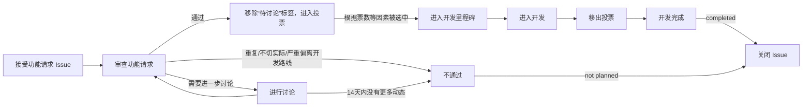
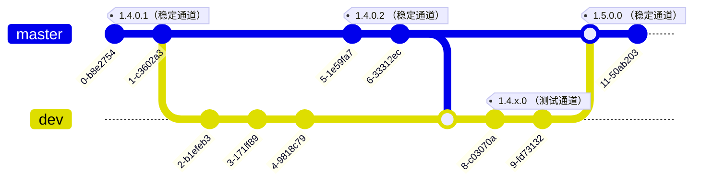

# 向 ClassIsland 贡献代码

❤️感谢您向 ClassIsland 做出贡献，您可以为 ClassIsland 项目做出包括但不限于反馈 Bug、提出功能请求、贡献代码等贡献。在进行贡献前，请务必阅读以下指南。

## 反馈 Bug

如果在使用 ClassIsland 的过程中遇到 Bug，可以在[Issues](https://github.com/ClassIsland/ClassIsland/issues/new?assignees=&labels=Bug&projects=&template=BugReport.yml&title=%EF%BC%88%E5%9C%A8%E8%BF%99%E9%87%8C%E8%BE%93%E5%85%A5%E4%BD%A0%E7%9A%84%E6%A0%87%E9%A2%98%EF%BC%89)中提交 Bug 反馈。

**请务必准确地按照 Issues 模板中的要求和示例填写相关字段**，否则开发者可能难以诊断您遇到的问题。

## 提交功能请求

如果您有关于 ClassIsland 新功能的想法，欢迎在[Issues](https://github.com/ClassIsland/ClassIsland/issues/new?assignees=&labels=%E6%96%B0%E5%8A%9F%E8%83%BD&projects=&template=FeatureRequest.yml&title=%EF%BC%88%E5%9C%A8%E8%BF%99%E9%87%8C%E8%BE%93%E5%85%A5%E4%BD%A0%E7%9A%84%E6%A0%87%E9%A2%98%EF%BC%89)提交功能请求。提交的功能请求必须满足以下要求：

- 提交的功能在应用版本，和[最新提交](https://github.com/ClassIsland/ClassIsland/commits/dev/)中还没有实现。
- 没有与此功能请求重复或相似的[Issues](https://github.com/ClassIsland/ClassIsland/issues?q=label%3A新功能) 。
- 提交的的功能是用户广泛需要的，插件不能替代的，且没有超出 ClassIsland 作为**灵动课表**的开发目标，而非添加与课表及教学辅助无关的内容。

提交的功能请求会按照以下流程处理：

您可以在[投票页面](https://github.com/ClassIsland/voting/discussions/categories/classisland)为您想要的功能进行投票，开发者会结合多种因素，优先处理票数较高的功能请求。需要注意，受限于时间和精力，**票数高的功能请求不是100%会被开发者优先处理**，还请谅解。如果您有能力，欢迎为本项目贡献代码。

## 贡献代码

在为 ClassIsland 贡献代码之前，请务必阅读以下指南。

下面是一些有用的资源：
- [ClassIsland 开发文档](https://docs.classisland.tech/dev)
- [项目看板](https://github.com/orgs/ClassIsland/projects/2)

### 贡献准则

**您为 ClassIsland 贡献的功能须遵循以下准则：**

- **稳定：** 您贡献的功能需要能尽可能稳定工作。
- **具有泛用性：** 您贡献的功能需要面向大部分用户。如果您贡献的功能专用性较强，可以考虑以[开发 ClassIsland 插件](https://docs.classisland.tech/zh-cn/latest/dev/)的形式提供此功能。
- **如果您贡献的功能比较激进，请添加功能开关，并默认禁用此功能。** 激进的功能一般指会对正常授课产生较大影响的功能。
- 尽量不要提交仅包含文案修复的 PR。

### 分支与开发周期

ClassIsland 代码仓库目前具有以下分支：

- [`dev`](https://github.com/HelloWRC/ClassIsland/tree/dev)：开发下一个版本的ClassIsland。
- [`master`](https://github.com/HelloWRC/ClassIsland/tree/master)：对目前最新发布的稳定版本进行维护。

在开发下一个版本的 ClassIsland 过程中，也会在`master`分支上并行维护当前稳定版本的功能，如以下示意图所示：

> [!note]
> 以下图表的提交id和标签名称仅供示意。

由于不同开发分支上的代码接口可能存在差异。因此，**根据您做出的贡献类型，您需要选择不同的基础分支。**

**以下类型的贡献建议以`master`为基础分支：**

- 修复稳定版中的 Bug
- 对稳定版中的功能进行小幅度的优化
- 修改README等文档

**以下类型的贡献建议以`dev`为基础分支：**

- 添加新的功能
- 对代码进行重构
- 其它对 ClassIsland 进行较大改动的贡献

### 提交

在本代码仓库提交时，请尽量遵守[约定式提交规范](https://www.conventionalcommits.org/zh-hans/v1.0.0/)。

### 合并更改

在进行合并之前，请先测试您贡献的代码，确保您贡献的代码能稳定运作。

您可以向本项目发起 [Pull Request](https://github.com/ClassIsland/ClassIsland/pulls) 来合并您的更改。在发起 Pull Request 时，请简要地描述您做的更改。

## 还有疑问？

您可以[加入QQ群](https://qm.qq.com/q/4NsDQKiAuQ)与开发者和其他用户讨论。
