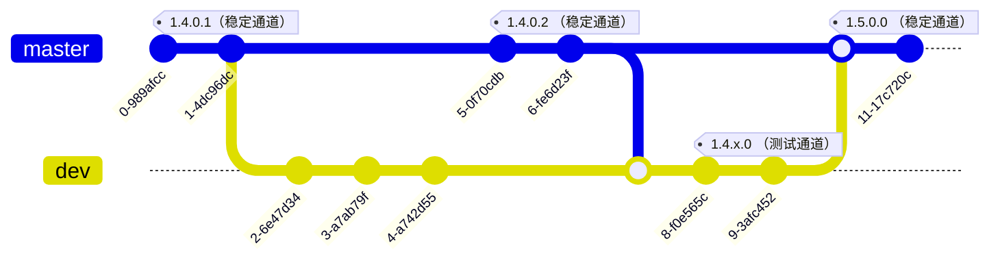

# 向 ClassIsland 贡献代码

❤️感谢您向 ClassIsland 贡献代码。在为 ClassIsland 贡献代码之前，请务必阅读以下指南。

下面是一些有用的资源：
- [ClassIsland 开发文档](https://docs.classisland.tech/zh-cn/latest/dev/)
- [项目看板](https://github.com/orgs/ClassIsland/projects/2)

## 贡献准则

**您为 ClassIsland 贡献的功能须遵循以下准则：**

- **稳定：** 您贡献的功能需要能尽可能稳定工作。
- **具有泛用性：** 您贡献的功能需要面向大部分用户。如果您贡献的功能专用性较强，可以考虑以[开发 ClassIsland 插件](https://docs.classisland.tech/zh-cn/latest/dev/)的形式提供此功能。
- **如果您贡献的功能比较激进，请添加功能开关，并默认禁用此功能。** 激进的功能一般指会对正常授课产生较大影响的功能。

## 分支与开发周期

ClassIsland 代码仓库目前具有以下分支：

- [`dev`](https://github.com/HelloWRC/ClassIsland/tree/dev)：开发下一个版本的ClassIsland。
- [`master`](https://github.com/HelloWRC/ClassIsland/tree/master)：对目前最新发布的稳定版本进行维护。

在开发下一个版本的 ClassIsland 过程中，也会在`master`分支上并行维护当前稳定版本的功能，如以下示意图所示：

> [!note]
> 以下图表的提交id和标签名称仅供示意。

由于不同开发分支上的代码接口可能存在差异。因此，**根据您做出的贡献类型，您需要选择不同的基础分支。**

**以下类型的贡献建议以`master`为基础分支：**

- 修复稳定版中的 Bug
- 对稳定版中的功能进行小幅度的优化
- 修改README等文档

**以下类型的贡献建议以`dev`为基础分支：**

- 添加新的功能
- 对代码进行重构
- 其它对 ClassIsland 进行较大改动的贡献

## 提交

在本代码仓库提交时，请尽量遵守[约定式提交规范](https://www.conventionalcommits.org/zh-hans/v1.0.0/)。

## 合并更改

在进行合并之前，请先测试您贡献的代码，确保您贡献的代码能稳定运作。

您可以向本项目发起 [Pull Request](https://github.com/ClassIsland/ClassIsland/pulls) 来合并您的更改。在发起 Pull Request 时，请简要地描述您做的更改。

## 还有疑问？

您可以[加入QQ群](https://qm.qq.com/q/4NsDQKiAuQ)与开发者和其他用户讨论。