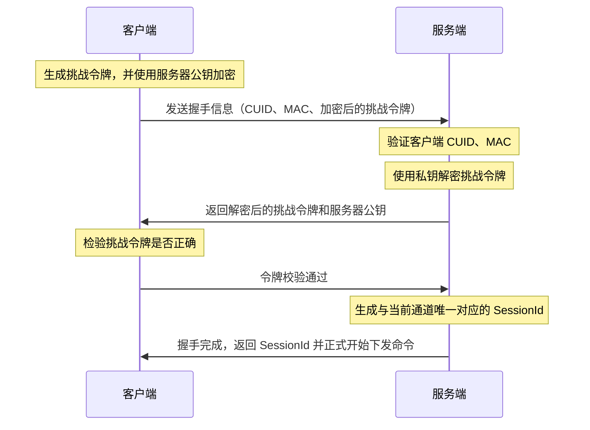
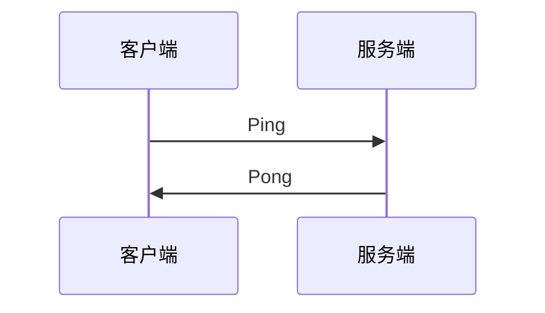

# 命令流

在客户端与集控服务器建立连接时，会启动一个命令流用于接受服务器下达的指令。

## 握手

在建立命令流连接前，对等端需要握手以验明双方的身份。

## 心跳包

客户端每 10 秒向服务器发送一个心跳包（Ping），服务器返回一个已接收的命令（Pong）。

## 重试

如果心跳包发送异常，或命令流连接断开，客户端会在出现异常开始，每 30 秒重试连接。重试时会再次进行新的握手流程，并接收新的 SessionId.
